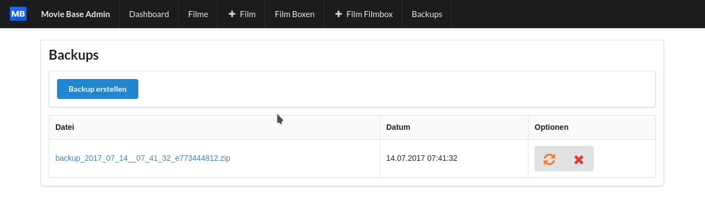

# MovieBase

Die MovieBase ist eine einfache und flexible Datenbank zum verwalten einer Filmsammlung. Alles ist für die Verwendung mit verschiedenen Geräten optimiert. Somit lässt sich die Filmsammlung bequem am PC, Tablet oder Smartphone verwalten.

---
## Anforderungen

* node.js ab Version 4
* Redis (Datenbankserver)
* die Backup/Restore Funktion kann nur unter Linux genutzt werden

---
## Funktionen

* Verwalten von Filmen
* Verwalten von Filmboxen (Sammlung aus mehreren Filmen in einer Box)
* Optimiert für alle Endgeräte (PC, Tablet, Smartphone)
* Backup/Restore

---
## Screenshots

